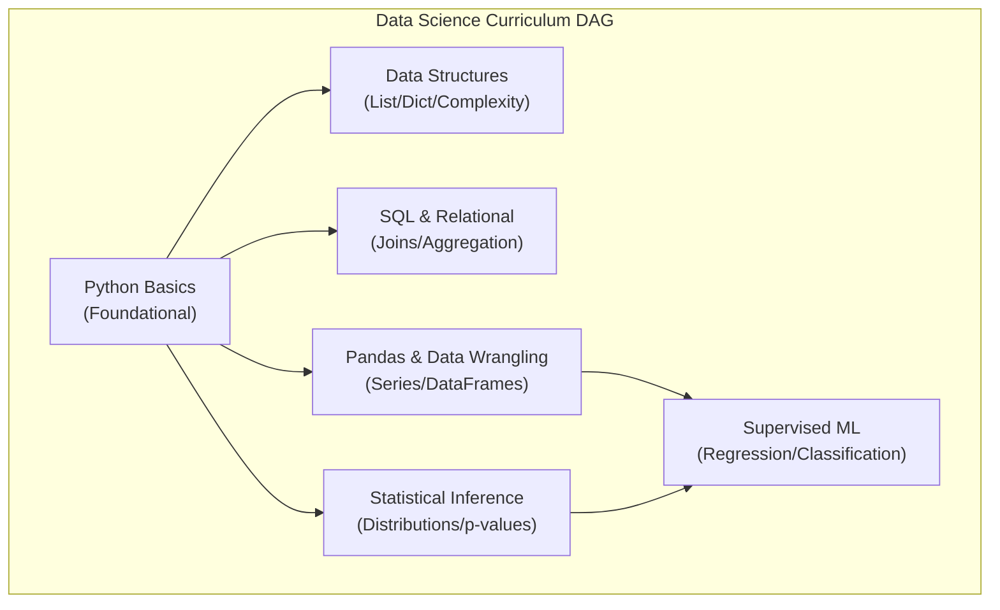

# SkillCompass — Competency Engine Specification

## 1. Philosophical Grounding & Design Mandate

In enterprise learning and technical education, conventional systems treat completion as capability. A student completes 10 hours of video lectures and is granted a certificate. Yet, when tasked with writing production code or performing real-world data analysis, fundamental deficiencies immediately surface.

**SkillCompass establishes a deterministic, evidence-based standard:**
- Competency is not an assumption; it is an assertion validated by observable performance evidence.
- Scores are never manufactured by generative LLM hallucinations.
- Competency states are mathematically verifiable, transparent, auditable, and resilient to arbitrary inflation.

---

## 2. The Deterministic Competency Model

The engine represents a learner's capability through a Directed Acyclic Graph (DAG) of competencies mapped to benchmark role profiles.

### 2.1 Core Elements of the Model

```
                    ┌─────────────────────────┐
                    │    ROLE BENCHMARK       │
                    │  (e.g., Data Scientist) │
                    └────────────┬────────────┘
                                 │ requires (RoleCompetency)
                                 ▼
                    ┌─────────────────────────┐
                    │   REQUIRED SCORE (R_c)  │
                    │    (e.g., Threshold 75) │
                    └────────────┬────────────┘
                                 │
                 ┌───────────────┴───────────────┐
                 ▼                               ▼
       ┌───────────────────┐           ┌───────────────────┐
       │ CURRENT SCORE (S) │           │   SKILL GAP (G)   │
       │ Computed from     │           │   G = max(0, R-S) │
       │ Evidence Ledger   │           │                   │
       └─────────┬─────────┘           └───────────────────┘
                 │
                 ▼
       ┌───────────────────┐
       │ COMPETENCY STATUS │
       │ Novice/Developing/│
       │ Proficient/Master │
       └───────────────────┘
```

1. **Competency Node ($c$):** A discrete atomic unit of knowledge or skill (e.g., `Python Basics`, `Relational Modeling`, `Statistical Sampling`).
2. **Required Competency Score ($R_c$):** The minimum baseline score ($0-100$) mandated by an industry role for competency $c$.
3. **Current Competency Score ($S_{u, c}$):** The learner's real-time capability metric calculated strictly from performance evidence.
4. **Skill Gap ($G_{u, c}$):** The quantitative deficit between the role benchmark and the learner's current score.
5. **Competency Evidence ($E$):** An immutable, weighted observation derived from an assessment item or practical challenge.
6. **Competency Status:** A discrete capability tier (`NOVICE`, `DEVELOPING`, `PROFICIENT`, `MASTER`).

---

## 3. Qualitative Competency Levels (Tiers)

Every continuous score ($0-100$) maps deterministically to a capability tier:

| Tier | Score Range | Description & Pedagogical Meaning |
| :--- | :---: | :--- |
| **`NOVICE`** | $0.00 - 39.99$ | Lacks basic syntax, core concepts, or fundamental intuition. High error rate on beginner diagnostic items. |
| **`DEVELOPING`** | $40.00 - 69.99$ | Understands core definitions and basic idioms, but struggles with edge cases, composite problems, and algorithmic reasoning. |
| **`PROFICIENT`** | $70.00 - 89.99$ | Solves standard problems independently, writes idiomatic solutions, and meets industry baseline for junior-to-mid roles. |
| **`MASTER`** | $90.00 - 100.00$ | Deep conceptual intuition, architectural awareness, high performance on advanced diagnostic edge cases. |

---

## 4. Mathematical Formulation & Scoring Mechanics

### 4.1 Evidence Formulation
Each time a learner submits an answer during an assessment or reassessment, an immutable row is inserted into `competency_evidence`:

$$e_i = (u, c, w_i, r_i, s_i, t_i)$$

Where:
- $u$ = Learner ID
- $c$ = Competency ID
- $w_i \in [0.5, 2.0]$ = Item importance weight (calibrated by difficulty)
- $r_i \in \{0.0, 1.0\}$ = Binary performance outcome ($1.0$ for correct, $0.0$ for incorrect)
- $s_i$ = Evidence source (`DIAGNOSTIC` or `REASSESSMENT`)
- $t_i$ = Timestamp

### 4.2 Score Calculation Equation
For learner $u$ and competency $c$ with total evidence count $N$:

$$S(u, c) = \left( \frac{\sum_{i=1}^{N} (w_i \times r_i)}{\sum_{i=1}^{N} w_i} \right) \times 100$$

Where $N \ge 1$. If $N = 0$, $S(u, c) = 0.00$.

### 4.3 Skill Gap Calculation Equation
Given role benchmark threshold $R_c$:

$$G(u, c) = \max(0.00, R_c - S(u, c))$$

- When $S(u, c) \ge R_c$, the gap is exactly $0.00$. The requirement is satisfied.
- When $S(u, c) < R_c$, the gap is the numerical deficit to be eliminated through targeted learning.

---

## 5. Concrete End-to-End Scoring Example

> *Note: The values below represent illustrative prototype values demonstrating exact engine behavior.*

### Step 1: Initial Baseline Setup
- **Target Role:** Junior Data Scientist
- **Evaluated Competency:** `Python Basics`
- **Required Score ($R$):** $75.00$

### Step 2: Diagnostic Assessment Administration
The learner answers 3 diagnostic questions mapped to `Python Basics`:
1. **Question 1 (Basic Syntax - Beginner):**
   - Weight ($w_1$) = $1.00$
   - Answer: Incorrect $\rightarrow r_1 = 0.0$
2. **Question 2 (Dict Lookup - Intermediate):**
   - Weight ($w_2$) = $1.20$
   - Answer: Correct $\rightarrow r_2 = 1.0$
3. **Question 3 (Generators/Iterators - Advanced):**
   - Weight ($w_3$) = $1.50$
   - Answer: Incorrect $\rightarrow r_3 = 0.0$

### Step 3: Baseline Calculation
$$\sum (w_i \times r_i) = (1.00 \times 0.0) + (1.20 \times 1.0) + (1.50 \times 0.0) = 1.20$$
$$\sum w_i = 1.00 + 1.20 + 1.50 = 3.70$$
$$\text{Baseline Score } (S_0) = \left( \frac{1.20}{3.70} \right) \times 100 = 32.43 \rightarrow 32.4\% \quad (\textbf{NOVICE})$$
$$\text{Baseline Gap } (G_0) = \max(0, 75.00 - 32.43) = \mathbf{42.57}$$

### Step 4: Targeted Learning & Targeted Reassessment
1. The recommendation engine detects $G_0 = 42.57$ and queues a 15-minute micro-resource: *"Python Iterators & Control Flow"*.
2. The user marks the resource complete and launches a **Targeted Reassessment** (3 questions focused on their missed concepts):
   - **Reassessment Q1 (Weight 1.20):** Correct $\rightarrow r_4 = 1.0$
   - **Reassessment Q2 (Weight 1.50):** Correct $\rightarrow r_5 = 1.0$
   - **Reassessment Q3 (Weight 1.50):** Correct $\rightarrow r_6 = 1.0$

### Step 5: Recalibration (Updated Ledger)
Total Evidence Ledger now contains 6 observations:
$$\sum_{\text{new}} (w_i \times r_i) = 1.20 + (1.20 \times 1.0) + (1.50 \times 1.0) + (1.50 \times 1.0) = 1.20 + 1.20 + 1.50 + 1.50 = 5.40$$
$$\sum_{\text{new}} w_i = 3.70 + 1.20 + 1.50 + 1.50 = 7.90$$
$$\text{Updated Score } (S_1) = \left( \frac{5.40}{7.90} \right) \times 100 = 68.35 \rightarrow 68.4\% \quad (\textbf{DEVELOPING})$$
$$\text{Updated Gap } (G_1) = \max(0, 75.00 - 68.35) = \mathbf{6.65}$$

**Result:** The skill gap collapsed from **$42.57 \rightarrow 6.65$**, demonstrating verifiable, measured progression.

---

## 6. Prerequisite Dependency Graph (DAG)

Competencies cannot be mastered in isolation. Advanced concepts require foundational prerequisites:



### Prerequisite Constraint Rule:
Before the recommendation engine will assign high-level modules (such as `Supervised ML`), all immediate upstream parent nodes in the DAG must achieve at least **`PROFICIENT`** status ($S \ge 70.0$). 

If a learner has a deficiency in both `Python Basics` ($S = 32$) and `Pandas` ($S = 20$), the recommendation engine locks `Pandas` until `Python Basics` reaches $S \ge 70.0$, preventing cognitive overload.

---

## 7. Determinism & Testability

Because the Competency Engine relies on pure relational queries and arithmetic operations:
1. **100% Deterministic:** Given identical evidence inputs, the calculated score and gap are identical every time.
2. **Unit Testable:** The engine can be tested using static fixtures without database mocks or internet connections:
```python
def test_competency_calculation():
    evidence = [
        {"weight": 1.0, "result": 1.0},
        {"weight": 1.0, "result": 0.0},
        {"weight": 2.0, "result": 1.0},
    ]
    # Sum(w*r) = 1 + 0 + 2 = 3
    # Sum(w) = 1 + 1 + 2 = 4
    # Score = 3/4 * 100 = 75.0
    score = calculate_score(evidence)
    assert score == 75.0
```
3. **No Drift:** Changes in external LLM model weights (e.g. OpenAI model updates) have zero impact on learner scores.
