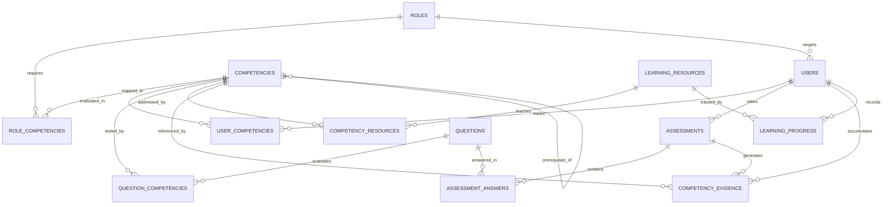

# SkillCompass — Database Schema Specification

## 1. Schema Overview & Relational Architecture

The SkillCompass persistence layer is built on **PostgreSQL / Supabase**. It enforces relational integrity, ACID transactions for assessment grading, and deterministic calculation histories through an append-only evidence log.



---

## 2. Table Specifications

### 2.1 `roles`
Stores professional target roles and industry benchmark profiles.

| Column | Data Type | Nullable | Default | Constraints / Description |
| :--- | :--- | :--- | :--- | :--- |
| `id` | `UUID` | No | `gen_random_uuid()` | **PK** |
| `title` | `VARCHAR(120)` | No | - | Unique role title (e.g., "Junior Data Scientist") |
| `description` | `TEXT` | No | - | Role overview and scope |
| `created_at` | `TIMESTAMPTZ` | No | `NOW()` | Audit timestamp |

---

### 2.2 `competencies`
Hierarchical taxonomy of skills, concepts, and capabilities.

| Column | Data Type | Nullable | Default | Constraints / Description |
| :--- | :--- | :--- | :--- | :--- |
| `id` | `UUID` | No | `gen_random_uuid()` | **PK** |
| `name` | `VARCHAR(100)` | No | - | Unique competency name (e.g., "Python Basics") |
| `description` | `TEXT` | No | - | Learning objectives and competency scope |
| `category` | `VARCHAR(50)` | No | - | Categorical group (e.g., "Programming", "Mathematics") |
| `prerequisite_id`| `UUID` | Yes | `NULL` | **FK** $\rightarrow$ `competencies.id` (Self-referential DAG) |
| `created_at` | `TIMESTAMPTZ` | No | `NOW()` | Audit timestamp |

---

### 2.3 `role_competencies`
Associative join table defining the exact benchmark requirement for each competency within a role.

| Column | Data Type | Nullable | Default | Constraints / Description |
| :--- | :--- | :--- | :--- | :--- |
| `id` | `UUID` | No | `gen_random_uuid()` | **PK** |
| `role_id` | `UUID` | No | - | **FK** $\rightarrow$ `roles.id` ON DELETE CASCADE |
| `competency_id` | `UUID` | No | - | **FK** $\rightarrow$ `competencies.id` ON DELETE CASCADE |
| `required_score`| `INTEGER` | No | `75` | Required target score (0–100 scale, typical: 70–85) |
| `weight` | `NUMERIC(3,2)` | No | `1.00` | Relative importance factor (0.50 to 2.00) |

*Unique Constraint:* `UNIQUE(role_id, competency_id)`

---

### 2.4 `users`
Registered learners and their active target role.

| Column | Data Type | Nullable | Default | Constraints / Description |
| :--- | :--- | :--- | :--- | :--- |
| `id` | `UUID` | No | `gen_random_uuid()` | **PK** |
| `email` | `VARCHAR(255)` | No | - | **UNIQUE**, learner email address |
| `full_name` | `VARCHAR(120)` | No | - | Display name |
| `target_role_id`| `UUID` | Yes | `NULL` | **FK** $\rightarrow$ `roles.id` ON DELETE SET NULL |
| `created_at` | `TIMESTAMPTZ` | No | `NOW()` | Account creation timestamp |
| `updated_at` | `TIMESTAMPTZ` | No | `NOW()` | Profile update timestamp |

---

### 2.5 `user_competencies`
Materialized, real-time snapshot of a user's competency level, calculated score, and current skill gap.

| Column | Data Type | Nullable | Default | Constraints / Description |
| :--- | :--- | :--- | :--- | :--- |
| `id` | `UUID` | No | `gen_random_uuid()` | **PK** |
| `user_id` | `UUID` | No | - | **FK** $\rightarrow$ `users.id` ON DELETE CASCADE |
| `competency_id` | `UUID` | No | - | **FK** $\rightarrow$ `competencies.id` ON DELETE CASCADE |
| `current_score` | `NUMERIC(5,2)` | No | `0.00` | Calculated deterministic score ($0.00 - 100.00$) |
| `status` | `VARCHAR(20)` | No | `'NOVICE'`| Enum: `'NOVICE'`, `'DEVELOPING'`, `'PROFICIENT'`, `'MASTER'` |
| `last_assessed_at`| `TIMESTAMPTZ`| Yes | `NULL` | Timestamp of latest evidence evaluation |
| `updated_at` | `TIMESTAMPTZ` | No | `NOW()` | Last recalculation timestamp |

*Unique Constraint:* `UNIQUE(user_id, competency_id)`

---

### 2.6 `questions`
Canonical catalog of diagnostic and assessment questions.

| Column | Data Type | Nullable | Default | Constraints / Description |
| :--- | :--- | :--- | :--- | :--- |
| `id` | `UUID` | No | `gen_random_uuid()` | **PK** |
| `text` | `TEXT` | No | - | The question stem / prompt text |
| `question_type` | `VARCHAR(30)` | No | `'SINGLE_CHOICE'` | Multiple choice, code snippet, or boolean |
| `difficulty` | `VARCHAR(20)` | No | `'INTERMEDIATE'` | Enum: `'BEGINNER'`, `'INTERMEDIATE'`, `'ADVANCED'` |
| `options` | `JSONB` | No | - | Array of choices: `[{"id": "A", "text": "..."}, ...]` |
| `correct_answer`| `VARCHAR(50)` | No | - | ID or value of correct choice (e.g., `'B'`) |
| `explanation` | `TEXT` | No | - | Canonical pedagogical explanation |
| `is_active` | `BOOLEAN` | No | `TRUE` | Active flag for query filtering |
| `created_at` | `TIMESTAMPTZ` | No | `NOW()` | Creation timestamp |

---

### 2.7 `question_competencies`
Many-to-many relationship mapping questions to one or more tested competencies with specific evaluation weights.

| Column | Data Type | Nullable | Default | Constraints / Description |
| :--- | :--- | :--- | :--- | :--- |
| `id` | `UUID` | No | `gen_random_uuid()` | **PK** |
| `question_id` | `UUID` | No | - | **FK** $\rightarrow$ `questions.id` ON DELETE CASCADE |
| `competency_id` | `UUID` | No | - | **FK** $\rightarrow$ `competencies.id` ON DELETE CASCADE |
| `weight` | `NUMERIC(3,2)` | No | `1.00` | Question relevance weight ($0.50$ to $2.00$) |

*Unique Constraint:* `UNIQUE(question_id, competency_id)`

---

### 2.8 `assessments`
Assessment instances and test sessions.

| Column | Data Type | Nullable | Default | Constraints / Description |
| :--- | :--- | :--- | :--- | :--- |
| `id` | `UUID` | No | `gen_random_uuid()` | **PK** |
| `user_id` | `UUID` | No | - | **FK** $\rightarrow$ `users.id` ON DELETE CASCADE |
| `role_id` | `UUID` | Yes | `NULL` | **FK** $\rightarrow$ `roles.id` (NULL for single-competency tests) |
| `assessment_type`| `VARCHAR(30)`| No | `'DIAGNOSTIC'` | Enum: `'DIAGNOSTIC'`, `'REASSESSMENT'` |
| `status` | `VARCHAR(20)` | No | `'IN_PROGRESS'` | Enum: `'IN_PROGRESS'`, `'COMPLETED'`, `'ABANDONED'` |
| `raw_score` | `NUMERIC(5,2)` | Yes | `NULL` | Overall percentage correct (0.00 to 100.00) |
| `created_at` | `TIMESTAMPTZ` | No | `NOW()` | Assessment start timestamp |
| `completed_at` | `TIMESTAMPTZ` | Yes | `NULL` | Completion timestamp |

---

### 2.9 `assessment_answers`
User submissions for each question in an assessment session.

| Column | Data Type | Nullable | Default | Constraints / Description |
| :--- | :--- | :--- | :--- | :--- |
| `id` | `UUID` | No | `gen_random_uuid()` | **PK** |
| `assessment_id`| `UUID` | No | - | **FK** $\rightarrow$ `assessments.id` ON DELETE CASCADE |
| `question_id` | `UUID` | No | - | **FK** $\rightarrow$ `questions.id` ON DELETE RESTRICT |
| `selected_answer`| `VARCHAR(50)`| No | - | User's selected option identifier (e.g. `'B'`) |
| `is_correct` | `BOOLEAN` | No | - | Binary correctness flag |
| `ai_explanation`| `TEXT` | Yes | `NULL` | Optional dynamic AI feedback on user's mistake |
| `answered_at` | `TIMESTAMPTZ` | No | `NOW()` | Timestamp answer was submitted |

*Unique Constraint:* `UNIQUE(assessment_id, question_id)`

---

### 2.10 `competency_evidence`
**The Core Audit Ledger.** Immutable record of every granular evidence event that influences a user's competency calculation.

| Column | Data Type | Nullable | Default | Constraints / Description |
| :--- | :--- | :--- | :--- | :--- |
| `id` | `UUID` | No | `gen_random_uuid()` | **PK** |
| `user_id` | `UUID` | No | - | **FK** $\rightarrow$ `users.id` ON DELETE CASCADE |
| `competency_id` | `UUID` | No | - | **FK** $\rightarrow$ `competencies.id` ON DELETE CASCADE |
| `assessment_id`| `UUID` | No | - | **FK** $\rightarrow$ `assessments.id` ON DELETE CASCADE |
| `question_id` | `UUID` | No | - | **FK** $\rightarrow$ `questions.id` ON DELETE RESTRICT |
| `weight` | `NUMERIC(3,2)` | No | `1.00` | Calibrated evidence weight ($w_i$) |
| `result` | `NUMERIC(3,2)` | No | - | Performance outcome ($r_i$): `1.00` = correct, `0.00` = wrong |
| `source` | `VARCHAR(30)` | No | `'DIAGNOSTIC'` | Enum: `'DIAGNOSTIC'`, `'REASSESSMENT'` |
| `created_at` | `TIMESTAMPTZ` | No | `NOW()` | Evidence generation timestamp |

---

### 2.11 `learning_resources`
Catalog of curated micro-learning resources mapped to specific topics.

| Column | Data Type | Nullable | Default | Constraints / Description |
| :--- | :--- | :--- | :--- | :--- |
| `id` | `UUID` | No | `gen_random_uuid()` | **PK** |
| `title` | `VARCHAR(255)` | No | - | Resource title |
| `url` | `TEXT` | No | - | Link to documentation, video, or tutorial |
| `resource_type` | `VARCHAR(30)` | No | `'ARTICLE'` | Enum: `'ARTICLE'`, `'VIDEO'`, `'EXERCISE'`, `'DOC'` |
| `estimated_minutes`| `INTEGER` | No | `15` | Estimated completion time in minutes |
| `created_at` | `TIMESTAMPTZ` | No | `NOW()` | Creation timestamp |

---

### 2.12 `competency_resources`
Many-to-many relationship linking learning resources to target competencies.

| Column | Data Type | Nullable | Default | Constraints / Description |
| :--- | :--- | :--- | :--- | :--- |
| `id` | `UUID` | No | `gen_random_uuid()` | **PK** |
| `competency_id` | `UUID` | No | - | **FK** $\rightarrow$ `competencies.id` ON DELETE CASCADE |
| `resource_id` | `UUID` | No | - | **FK** $\rightarrow$ `learning_resources.id` ON DELETE CASCADE |

*Unique Constraint:* `UNIQUE(competency_id, resource_id)`

---

### 2.13 `learning_progress`
User engagement and completion status for recommended learning resources.

| Column | Data Type | Nullable | Default | Constraints / Description |
| :--- | :--- | :--- | :--- | :--- |
| `id` | `UUID` | No | `gen_random_uuid()` | **PK** |
| `user_id` | `UUID` | No | - | **FK** $\rightarrow$ `users.id` ON DELETE CASCADE |
| `resource_id` | `UUID` | No | - | **FK** $\rightarrow$ `learning_resources.id` ON DELETE CASCADE |
| `status` | `VARCHAR(20)` | No | `'NOT_STARTED'` | Enum: `'NOT_STARTED'`, `'IN_PROGRESS'`, `'COMPLETED'` |
| `completed_at` | `TIMESTAMPTZ` | Yes | `NULL` | Completion timestamp |
| `updated_at` | `TIMESTAMPTZ` | No | `NOW()` | Update timestamp |

*Unique Constraint:* `UNIQUE(user_id, resource_id)`

---

## 3. Database Indexes

To guarantee sub-second queries during live demos, the following performance indexes are required:

```sql
-- User and Role Lookup
CREATE INDEX idx_users_target_role ON users(target_role_id);

-- Competency Calculations & Evidence Lookups
CREATE INDEX idx_user_competencies_user ON user_competencies(user_id);
CREATE INDEX idx_competency_evidence_user_comp ON competency_evidence(user_id, competency_id);
CREATE INDEX idx_competency_evidence_created ON competency_evidence(created_at DESC);

-- Assessment Sessions & Submissions
CREATE INDEX idx_assessments_user ON assessments(user_id, status);
CREATE INDEX idx_assessment_answers_assessment ON assessment_answers(assessment_id);

-- Mapping Relations
CREATE INDEX idx_role_competencies_role ON role_competencies(role_id);
CREATE INDEX idx_question_competencies_comp ON question_competencies(competency_id);
CREATE INDEX idx_competency_resources_comp ON competency_resources(competency_id);
CREATE INDEX idx_learning_progress_user ON learning_progress(user_id);
```

---

## 4. Seed Data Strategy for 24-Hour MVP

To ensure the system works immediately upon first boot without external dependencies:
1. **One Benchmark Role:**  
   `Junior Data Scientist`
2. **Six Structured Competencies (with Prerequisite DAG):**
   - `COMP_PY_BASE`: Python Basics (No prerequisite)
   - `COMP_DATA_STRUCT`: Data Structures & Algorithms (`prerequisite_id` = `COMP_PY_BASE`)
   - `COMP_SQL`: SQL & Relational Querying (No prerequisite)
   - `COMP_PANDAS`: Data Analysis with Pandas (`prerequisite_id` = `COMP_PY_BASE`)
   - `COMP_STATS`: Statistical Inference (`prerequisite_id` = `COMP_PY_BASE`)
   - `COMP_ML_BASE`: Supervised Machine Learning (`prerequisite_id` = `COMP_PANDAS`)
3. **Role Thresholds (`role_competencies`):**
   - Python Basics: Target 80
   - Data Structures: Target 75
   - SQL: Target 70
   - Pandas: Target 80
   - Stats: Target 70
   - Machine Learning: Target 65
4. **Question Bank (`questions`):**  
   18 pre-authored multiple-choice questions (3 questions per competency) with calibrated weights ($1.0$ to $1.5$).
5. **Learning Resources (`learning_resources`):**  
   12 targeted tutorials (2 per competency) with duration and external links.
