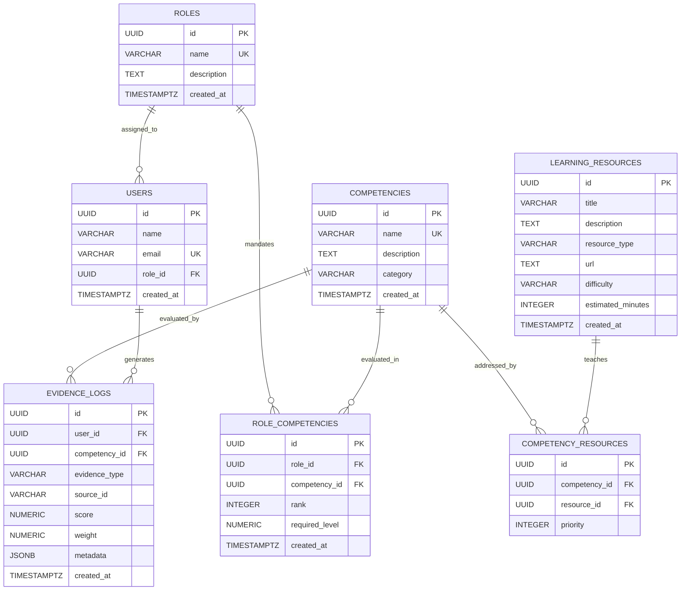

# SkillCompass — Database Schema Specification

## 1. Schema Overview & Relational Architecture

The SkillCompass persistence layer is built on **PostgreSQL / Supabase**. It provides the concrete data foundation for the platform, enforcing referential integrity, benchmark constraints, source-derived rankings, and an auditable append-only evidence log (`evidence_logs`).



---

## 2. Table Specifications

### 2.1 `roles`
Stores industry roles and benchmark profiles.

| Column | Data Type | Nullable | Default | Constraints / Description |
| :--- | :--- | :--- | :--- | :--- |
| `id` | `UUID` | No | `gen_random_uuid()` | **Primary Key** |
| `name` | `VARCHAR(100)` | No | - | **UNIQUE**, role title (`Data Engineer`, `Cybersecurity Analyst / Engineer`, `Network Engineer`) |
| `description` | `TEXT` | No | - | Overview of the role and scope |
| `created_at` | `TIMESTAMPTZ` | No | `NOW()` | Creation audit timestamp |

---

### 2.2 `users`
Registered learners and their active target role.

| Column | Data Type | Nullable | Default | Constraints / Description |
| :--- | :--- | :--- | :--- | :--- |
| `id` | `UUID` | No | `gen_random_uuid()` | **Primary Key** |
| `name` | `VARCHAR(120)` | No | - | Learner display name |
| `email` | `VARCHAR(255)` | No | - | **UNIQUE**, learner contact address |
| `role_id` | `UUID` | Yes | `NULL` | **Foreign Key** $\rightarrow$ `roles.id` ON DELETE SET NULL |
| `created_at` | `TIMESTAMPTZ` | No | `NOW()` | Registration timestamp |

---

### 2.3 `competencies`
Taxonomy of 17 discrete, reusable technical and engineering competencies.

| Column | Data Type | Nullable | Default | Constraints / Description |
| :--- | :--- | :--- | :--- | :--- |
| `id` | `UUID` | No | `gen_random_uuid()` | **Primary Key** |
| `name` | `VARCHAR(100)` | No | - | **UNIQUE**, competency name |
| `description` | `TEXT` | No | - | Detailed description and focus concepts |
| `category` | `VARCHAR(50)` | No | - | Taxonomy category (e.g., `Data Architecture`, `Security Operations`) |
| `created_at` | `TIMESTAMPTZ` | No | `NOW()` | Creation timestamp |

---

### 2.4 `role_competencies`
Defines benchmark competency requirements for each role.

| Column | Data Type | Nullable | Default | Constraints / Description |
| :--- | :--- | :--- | :--- | :--- |
| `id` | `UUID` | No | `gen_random_uuid()` | **Primary Key** |
| `role_id` | `UUID` | No | - | **Foreign Key** $\rightarrow$ `roles.id` ON DELETE CASCADE |
| `competency_id` | `UUID` | No | - | **Foreign Key** $\rightarrow$ `competencies.id` ON DELETE CASCADE |
| `rank` | `INTEGER` | No | - | **CHECK** (`rank >= 1`), Source-derived priority ($1, 2, 3...$) |
| `required_level`| `NUMERIC(5,2)` | No | - | **CHECK** (`required_level BETWEEN 0 AND 100`), Prototype target score |
| `created_at` | `TIMESTAMPTZ` | No | `NOW()` | Record timestamp |

- **Unique Constraints:**
  - `CONSTRAINT uq_role_competency UNIQUE (role_id, competency_id)`
  - `CONSTRAINT uq_role_rank UNIQUE (role_id, rank)`

#### Critical Distinction: Source-Based Rank vs. Prototype Required Level
- **`rank` (Source Priority):** Taken directly from the project reference curriculum. Represents the hierarchical importance and natural sequence of the skill for the role.
- **`required_level` (Prototype Score Threshold):** A numeric benchmark ($0.00 - 100.00$) used by the deterministic Competency Engine. The reference curriculum provides priority rankings, **not official percentage standards**. Prototype thresholds are provided for functional demonstration and are easily adjustable.

---

### 2.5 `learning_resources`
Curated index of authoritative, publicly accessible learning materials.

| Column | Data Type | Nullable | Default | Constraints / Description |
| :--- | :--- | :--- | :--- | :--- |
| `id` | `UUID` | No | `gen_random_uuid()` | **Primary Key** |
| `title` | `VARCHAR(255)` | No | - | Resource title |
| `description` | `TEXT` | No | - | Brief overview of concepts covered |
| `resource_type` | `VARCHAR(50)` | No | - | **CHECK** (`resource_type IN ('documentation', 'tutorial', 'article', 'video', 'pdf', 'guide', 'exercise')`) |
| `url` | `TEXT` | No | - | Canonical public URL (e.g. docs.python.org, kafka.apache.org) |
| `difficulty` | `VARCHAR(20)` | No | - | **CHECK** (`difficulty IN ('beginner', 'intermediate', 'advanced')`) |
| `estimated_minutes`| `INTEGER` | No | - | **CHECK** (`estimated_minutes > 0`) |
| `created_at` | `TIMESTAMPTZ` | No | `NOW()` | Creation timestamp |

---

### 2.6 `competency_resources`
Many-to-many associative entity mapping learning resources to competencies with recommendation priority.

| Column | Data Type | Nullable | Default | Constraints / Description |
| :--- | :--- | :--- | :--- | :--- |
| `id` | `UUID` | No | `gen_random_uuid()` | **Primary Key** |
| `competency_id` | `UUID` | No | - | **Foreign Key** $\rightarrow$ `competencies.id` ON DELETE CASCADE |
| `resource_id` | `UUID` | No | - | **Foreign Key** $\rightarrow$ `learning_resources.id` ON DELETE CASCADE |
| `priority` | `INTEGER` | No | `1` | **CHECK** (`priority >= 1`), ordering rank for recommendations |

- **Unique Constraint:** `CONSTRAINT uq_competency_resource UNIQUE (competency_id, resource_id)`

---

### 2.7 `evidence_logs`
The foundational audit ledger capturing observable performance events (diagnostics, reassessments, activities).

| Column | Data Type | Nullable | Default | Constraints / Description |
| :--- | :--- | :--- | :--- | :--- |
| `id` | `UUID` | No | `gen_random_uuid()` | **Primary Key** |
| `user_id` | `UUID` | No | - | **Foreign Key** $\rightarrow$ `users.id` ON DELETE CASCADE |
| `competency_id` | `UUID` | No | - | **Foreign Key** $\rightarrow$ `competencies.id` ON DELETE CASCADE |
| `evidence_type` | `VARCHAR(50)` | No | - | **CHECK** (`evidence_type IN ('diagnostic', 'reassessment', 'learning_activity', 'manual')`) |
| `source_id` | `VARCHAR(100)` | Yes | `NULL` | External or assessment session identifier |
| `score` | `NUMERIC(5,2)` | No | - | **CHECK** (`score BETWEEN 0 AND 100`) |
| `weight` | `NUMERIC(4,2)` | No | `1.00` | **CHECK** (`weight > 0`) |
| `metadata` | `JSONB` | No | `'{}'::jsonb` | Extensible payload (items attempted, session details, etc.) |
| `created_at` | `TIMESTAMPTZ` | No | `NOW()` | Event timestamp |

> **Technical Principle:**  
> "AI interprets and generates. Structured logic calculates and tracks competency."  
> AI never sets an arbitrary competency score. Evidence stored here represents an observable learner event.

---

## 3. Database Indexes

```sql
CREATE INDEX idx_users_role_id ON users(role_id);
CREATE INDEX idx_role_competencies_role_id ON role_competencies(role_id);
CREATE INDEX idx_role_competencies_competency_id ON role_competencies(competency_id);
CREATE INDEX idx_role_competencies_role_rank ON role_competencies(role_id, rank);
CREATE INDEX idx_competency_resources_competency_id ON competency_resources(competency_id);
CREATE INDEX idx_competency_resources_resource_id ON competency_resources(resource_id);
CREATE INDEX idx_evidence_logs_user_id ON evidence_logs(user_id);
CREATE INDEX idx_evidence_logs_competency_id ON evidence_logs(competency_id);
CREATE INDEX idx_evidence_logs_user_competency ON evidence_logs(user_id, competency_id);
CREATE INDEX idx_evidence_logs_created_at ON evidence_logs(created_at DESC);
```

---

## 4. Roles, Competencies & Benchmark Reference Matrix

### 4.1 Data Engineer (6 Competencies)
| Rank (Source) | Competency | Category | Prototype Target | Key Focus Areas |
| :---: | :--- | :--- | :---: | :--- |
| **1** | **SQL & Data Modeling** | Data Architecture | 85.00 | Relational schemas, normalization, analytical SQL, window functions, CTEs. |
| **2** | **Python / Scala** | Programming | 80.00 | Data manipulation (Pandas, PySpark), OOP, scripting. |
| **3** | **Distributed Computing & Big Data** | Big Data | 75.00 | Apache Spark, Hadoop ecosystem, MapReduce concepts. |
| **4** | **Data Pipelining & Orchestration** | Data Engineering | 80.00 | Apache Airflow, Prefect, ETL/ELT design, DAG management. |
| **5** | **Data Warehousing & Cloud** | Cloud & Infrastructure | 75.00 | Snowflake, BigQuery, AWS Redshift, lakehouse architectures. |
| **6** | **Streaming Data Processing** | Stream Processing | 70.00 | Apache Kafka, Flink, real-time ingestion pipelines. |

### 4.2 Cybersecurity Analyst / Engineer (5 Competencies)
*Note: The reference material provided 5 visible competencies. As per project constraints, no 6th competency is invented.*
| Rank (Source) | Competency | Category | Prototype Target | Key Focus Areas |
| :---: | :--- | :--- | :---: | :--- |
| **1** | **Network & OS Fundamentals** | Systems & Networks | 85.00 | TCP/IP, OSI model, Linux/Windows administration, security protocols. |
| **2** | **Threat Detection & SIEM** | Security Operations | 80.00 | Log analysis, Splunk, Elastic Security, SOC monitoring. |
| **3** | **Vulnerability Assessment & Pen Testing** | Offensive Security | 75.00 | Nmap, Wireshark, Burp Suite, OWASP Top 10, penetration testing. |
| **4** | **Identity & Access Management (IAM)** | Access Control | 75.00 | Zero Trust architecture, RBAC, Active Directory, OAuth/SAML. |
| **5** | **Incident Response & Digital Forensics** | Incident Response | 70.00 | Malware analysis, containment strategies, memory analysis. |

### 4.3 Network Engineer (6 Competencies)
| Rank (Source) | Competency | Category | Prototype Target | Key Focus Areas |
| :---: | :--- | :--- | :---: | :--- |
| **1** | **Routing & Switching Fundamentals** | Networking | 85.00 | VLANs, STP, subnetting, IPv4/IPv6, OSPF, BGP routing protocols. |
| **2** | **Network Infrastructure & Hardware** | Hardware & Infrastructure | 80.00 | Routers, switches, firewalls. |
| **3** | **Network Automation & Scripting** | Automation | 70.00 | Python, Netmiko, NAPALM, Ansible, REST APIs for network devices. |
| **4** | **Network Security & Firewalls** | Network Security | 80.00 | VPNs (IPsec/SSL), ACLs, IDS/IPS. |
| **5** | **Cloud Networking & SD-WAN** | Cloud Networking | 75.00 | AWS VPC, Azure Virtual Networks, Software-Defined WAN (SD-WAN). |
| **6** | **Network Monitoring & Troubleshooting** | Monitoring | 75.00 | Wireshark, SNMP, Nagios, packet capturing, latency optimization. |

---

## 5. Verification & Integrity Queries

```sql
-- 1. Check entity counts (Expected: 3 roles, 17 competencies, 17 requirements, 15 resources, 17 mappings)
SELECT 
    (SELECT COUNT(*) FROM roles) AS total_roles,
    (SELECT COUNT(*) FROM competencies) AS total_competencies,
    (SELECT COUNT(*) FROM role_competencies) AS total_requirements,
    (SELECT COUNT(*) FROM learning_resources) AS total_resources,
    (SELECT COUNT(*) FROM competency_resources) AS total_mappings;

-- 2. Verify competency count and rank range per role
SELECT 
    r.name AS role_name,
    COUNT(rc.competency_id) AS competencies_count,
    MIN(rc.rank) AS min_rank,
    MAX(rc.rank) AS max_rank
FROM roles r
JOIN role_competencies rc ON r.id = rc.role_id
GROUP BY r.name
ORDER BY r.name;

-- 3. Verify that each competency maps to learning resources
SELECT 
    c.name AS competency_name,
    COUNT(cr.resource_id) AS mapped_resources
FROM competencies c
LEFT JOIN competency_resources cr ON c.id = cr.competency_id
GROUP BY c.name
ORDER BY mapped_resources ASC;
```
