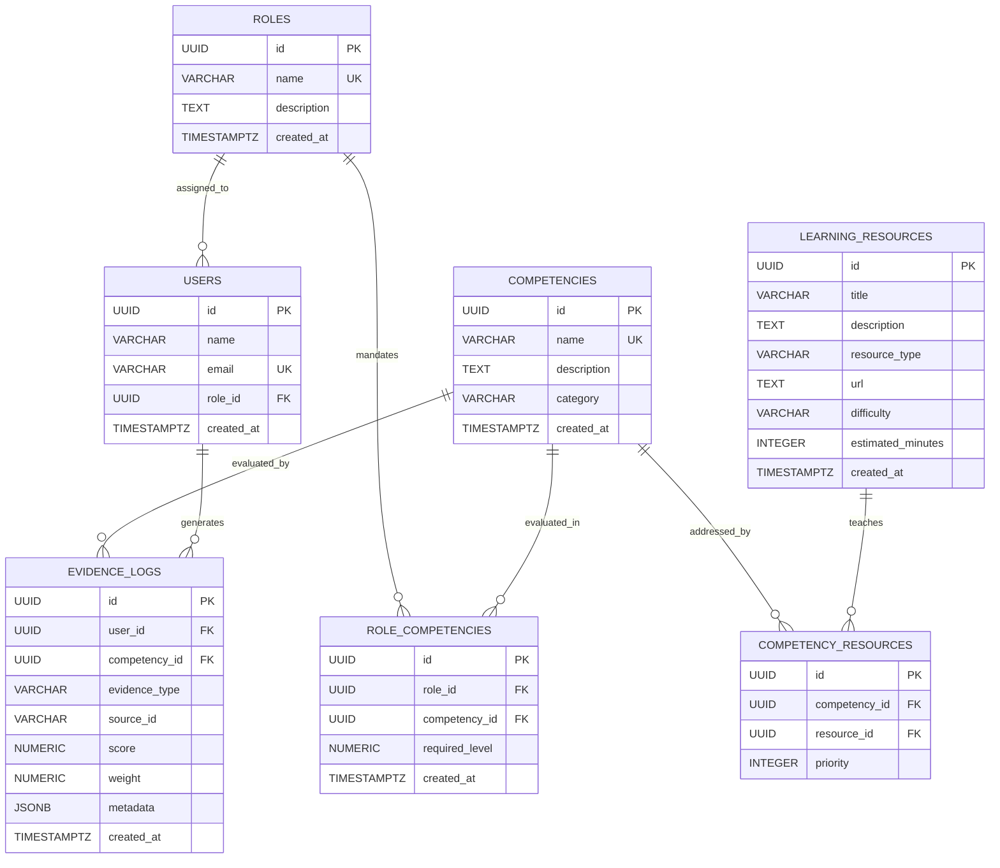

# SkillCompass — Database Schema Specification

## 1. Schema Overview & Relational Architecture

The SkillCompass persistence layer is built on **PostgreSQL / Supabase**. It provides the concrete data foundation for the platform, enforcing referential integrity, benchmark constraints, and an auditable append-only evidence log (`evidence_logs`).



---

## 2. Table Specifications

### 2.1 `roles`
Stores industry roles and benchmark profiles.

| Column | Data Type | Nullable | Default | Constraints / Description |
| :--- | :--- | :--- | :--- | :--- |
| `id` | `UUID` | No | `gen_random_uuid()` | **Primary Key** |
| `name` | `VARCHAR(100)` | No | - | **UNIQUE**, role title (e.g., "Statistical Officer", "Data Analyst") |
| `description` | `TEXT` | No | - | Overview of the role and scope |
| `created_at` | `TIMESTAMPTZ` | No | `NOW()` | Creation audit timestamp |

---

### 2.2 `users`
Registered learners and their active target role.

| Column | Data Type | Nullable | Default | Constraints / Description |
| :--- | :--- | :--- | :--- | :--- |
| `id` | `UUID` | No | `gen_random_uuid()` | **Primary Key** |
| `name` | `VARCHAR(120)` | No | - | Learner display name |
| `email` | `VARCHAR(255)` | No | - | **UNIQUE**, learner contact address |
| `role_id` | `UUID` | Yes | `NULL` | **Foreign Key** $\rightarrow$ `roles.id` ON DELETE SET NULL |
| `created_at` | `TIMESTAMPTZ` | No | `NOW()` | Registration timestamp |

---

### 2.3 `competencies`
Taxonomy of 8 atomic technical and analytical competencies.

| Column | Data Type | Nullable | Default | Constraints / Description |
| :--- | :--- | :--- | :--- | :--- |
| `id` | `UUID` | No | `gen_random_uuid()` | **Primary Key** |
| `name` | `VARCHAR(100)` | No | - | **UNIQUE**, competency name (e.g., "Python", "SQL", "Sampling") |
| `description` | `TEXT` | No | - | Concise description of the skill and expectations |
| `category` | `VARCHAR(50)` | No | - | Taxonomy category (e.g., "Programming", "Mathematics") |
| `created_at` | `TIMESTAMPTZ` | No | `NOW()` | Creation timestamp |

---

### 2.4 `role_competencies`
Defines benchmark competency requirements for each role on a 0–100 numeric scale.

| Column | Data Type | Nullable | Default | Constraints / Description |
| :--- | :--- | :--- | :--- | :--- |
| `id` | `UUID` | No | `gen_random_uuid()` | **Primary Key** |
| `role_id` | `UUID` | No | - | **Foreign Key** $\rightarrow$ `roles.id` ON DELETE CASCADE |
| `competency_id` | `UUID` | No | - | **Foreign Key** $\rightarrow$ `competencies.id` ON DELETE CASCADE |
| `required_level`| `NUMERIC(5,2)` | No | - | **CHECK** (`required_level BETWEEN 0 AND 100`) |
| `created_at` | `TIMESTAMPTZ` | No | `NOW()` | Record timestamp |

- **Unique Constraint:** `CONSTRAINT uq_role_competency UNIQUE (role_id, competency_id)`

---

### 2.5 `learning_resources`
Curated index of authoritative, publicly accessible learning materials.

| Column | Data Type | Nullable | Default | Constraints / Description |
| :--- | :--- | :--- | :--- | :--- |
| `id` | `UUID` | No | `gen_random_uuid()` | **Primary Key** |
| `title` | `VARCHAR(255)` | No | - | Resource title |
| `description` | `TEXT` | No | - | Brief overview of concepts covered |
| `resource_type` | `VARCHAR(50)` | No | - | **CHECK** (`resource_type IN ('documentation', 'tutorial', 'article', 'video', 'pdf', 'guide', 'exercise')`) |
| `url` | `TEXT` | No | - | Canonical public URL (e.g. docs.python.org, postgresqltutorial.com) |
| `difficulty` | `VARCHAR(20)` | No | - | **CHECK** (`difficulty IN ('beginner', 'intermediate', 'advanced')`) |
| `estimated_minutes`| `INTEGER` | No | - | **CHECK** (`estimated_minutes > 0`) |
| `created_at` | `TIMESTAMPTZ` | No | `NOW()` | Creation timestamp |

---

### 2.6 `competency_resources`
Many-to-many associative entity mapping learning resources to competencies with priority ordering.

| Column | Data Type | Nullable | Default | Constraints / Description |
| :--- | :--- | :--- | :--- | :--- |
| `id` | `UUID` | No | `gen_random_uuid()` | **Primary Key** |
| `competency_id` | `UUID` | No | - | **Foreign Key** $\rightarrow$ `competencies.id` ON DELETE CASCADE |
| `resource_id` | `UUID` | No | - | **Foreign Key** $\rightarrow$ `learning_resources.id` ON DELETE CASCADE |
| `priority` | `INTEGER` | No | `1` | **CHECK** (`priority >= 1`), ordering rank for recommendations |

- **Unique Constraint:** `CONSTRAINT uq_competency_resource UNIQUE (competency_id, resource_id)`

---

### 2.7 `evidence_logs`
The foundational audit ledger capturing observable performance events (diagnostics, reassessments, activities).

| Column | Data Type | Nullable | Default | Constraints / Description |
| :--- | :--- | :--- | :--- | :--- |
| `id` | `UUID` | No | `gen_random_uuid()` | **Primary Key** |
| `user_id` | `UUID` | No | - | **Foreign Key** $\rightarrow$ `users.id` ON DELETE CASCADE |
| `competency_id` | `UUID` | No | - | **Foreign Key** $\rightarrow$ `competencies.id` ON DELETE CASCADE |
| `evidence_type` | `VARCHAR(50)` | No | - | **CHECK** (`evidence_type IN ('diagnostic', 'reassessment', 'learning_activity', 'manual')`) |
| `source_id` | `VARCHAR(100)` | Yes | `NULL` | External or assessment session identifier |
| `score` | `NUMERIC(5,2)` | No | - | **CHECK** (`score BETWEEN 0 AND 100`) |
| `weight` | `NUMERIC(4,2)` | No | `1.00` | **CHECK** (`weight > 0`) |
| `metadata` | `JSONB` | No | `'{}'::jsonb` | Extensible payload (question breakdown, duration, etc.) |
| `created_at` | `TIMESTAMPTZ` | No | `NOW()` | Event timestamp |

> **Critical Guardrail:**  
> AI never sets an arbitrary competency score. Evidence stored here must always represent an observable event. The competency engine computes `current_score` and `skill_gap` from this table.

---

## 3. Database Indexes

```sql
CREATE INDEX IF NOT EXISTS idx_users_role_id ON users(role_id);
CREATE INDEX IF NOT EXISTS idx_role_competencies_role_id ON role_competencies(role_id);
CREATE INDEX IF NOT EXISTS idx_role_competencies_competency_id ON role_competencies(competency_id);
CREATE INDEX IF NOT EXISTS idx_competency_resources_competency_id ON competency_resources(competency_id);
CREATE INDEX IF NOT EXISTS idx_competency_resources_resource_id ON competency_resources(resource_id);
CREATE INDEX IF NOT EXISTS idx_evidence_logs_user_id ON evidence_logs(user_id);
CREATE INDEX IF NOT EXISTS idx_evidence_logs_competency_id ON evidence_logs(competency_id);
CREATE INDEX IF NOT EXISTS idx_evidence_logs_user_competency ON evidence_logs(user_id, competency_id);
CREATE INDEX IF NOT EXISTS idx_evidence_logs_created_at ON evidence_logs(created_at DESC);
```

---

## 4. Seed Data Benchmark Matrix

### Roles & Prototype Required Levels (0–100 Scale)

| Competency | Statistical Officer | Data Analyst | Primary Category |
| :--- | :---: | :---: | :--- |
| **Python** | 75 | 70 | Programming |
| **SQL** | 65 | 80 | Database |
| **Sampling** | 80 | 55 | Methodology |
| **Data Visualization** | 70 | 80 | Communication |
| **Statistics** | 85 | 70 | Mathematics |
| **Data Cleaning** | 65 | 80 | Engineering |
| **Data Analysis** | 75 | 85 | Analytics |
| **Problem Solving** | 70 | 75 | Cognitive |

---

## 5. Verification Queries

```sql
-- 1. Verify entity counts
SELECT 
    (SELECT COUNT(*) FROM roles) AS total_roles,
    (SELECT COUNT(*) FROM competencies) AS total_competencies,
    (SELECT COUNT(*) FROM role_competencies) AS total_requirements,
    (SELECT COUNT(*) FROM learning_resources) AS total_resources,
    (SELECT COUNT(*) FROM competency_resources) AS total_mappings;

-- 2. Verify each role has exactly 8 competencies
SELECT r.name, COUNT(rc.competency_id) AS competencies_count
FROM roles r
JOIN role_competencies rc ON r.id = rc.role_id
GROUP BY r.name;

-- 3. Verify each competency has indexed learning resources
SELECT c.name, COUNT(cr.resource_id) AS resources_count
FROM competencies c
LEFT JOIN competency_resources cr ON c.id = cr.competency_id
GROUP BY c.name;
```
