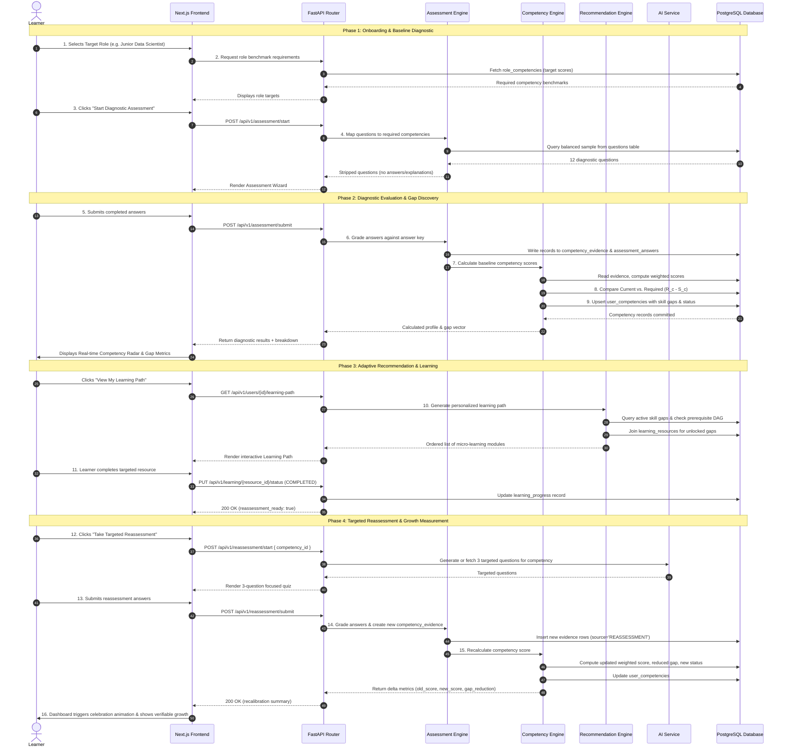

# SkillCompass — End-to-End Data Flow

## 1. Overview

This document provides a comprehensive, step-by-step trace of the complete SkillCompass competency lifecycle. It describes the 16 distinct phases of data transformation, from initial role onboarding to measured competency growth.

---

## 2. The 16-Step End-to-End Data Journey

---

## 3. Deep Dive into Key Data Transformations

### Steps 1–4: Profile Onboarding & Question Calibration
- **Input:** User chooses `role_id = 11111111-1111-1111-1111-111111111111` (*Junior Data Scientist*).
- **Transformation:** The system joins `role_competencies` and `question_competencies` to assemble a balanced multi-competency test session containing exactly 2 questions per competency.
- **Output:** Client receives a sanitized session object with questions, option choices, and difficulty ratings.

### Steps 5–9: Raw Grading to Competency Ledger
- **Input:** JSON array of `{question_id, selected_answer}` pairs.
- **Transformation:**
  1. `AssessmentEngine` compares `selected_answer` against canonical `correct_answer`.
  2. For every item, inserts a row into `assessment_answers` containing binary `is_correct`.
  3. Inserts corresponding rows into `competency_evidence` with the question's calibrated weight $w_i$.
  4. `CompetencyEngine` applies the deterministic formula:
     $$\text{Score} = \left(\frac{\sum w_i r_i}{\sum w_i}\right) \times 100$$
  5. Computes $\text{SkillGap} = \max(0, R_c - \text{Score})$.
- **Output:** Materialized records in `user_competencies` indicating exact scores (e.g. Python: $34.0$, Gap: $41.0$).

### Steps 10–11: DAG Traversing & Learning Path Formulation
- **Input:** List of competency gaps for the user.
- **Transformation:**
  1. Engine checks if prerequisites for deficient competencies are satisfied ($S \ge 70$).
  2. Blocks locked topics (e.g., *Pandas* is locked if *Python Basics* has not met proficiency).
  3. Unlocked topics are sorted descending by gap magnitude.
  4. Matches unlocked competencies with entries in `learning_resources`.
- **Output:** Sequential learning path payload delivered to Next.js frontend.

### Steps 12–16: Targeted Reassessment & Verifiable Measurement
- **Input:** User completes micro-resource and requests reassessment on *Python Basics*.
- **Transformation:**
  1. System serves 3 focused questions addressing previously missed concepts.
  2. User answers correctly (e.g., 3/3).
  3. New evidence rows are appended to `competency_evidence` with `source='REASSESSMENT'`.
  4. `CompetencyEngine` recalculates the cumulative weighted score.
  5. Current score rises (e.g., from $34.0 \rightarrow 72.0$), collapsing the gap from $41.0 \rightarrow 3.0$.
- **Output:** Dashboard visually reflects the updated score, gap reduction, and upgraded status (`NOVICE` $\rightarrow$ `PROFICIENT`).
