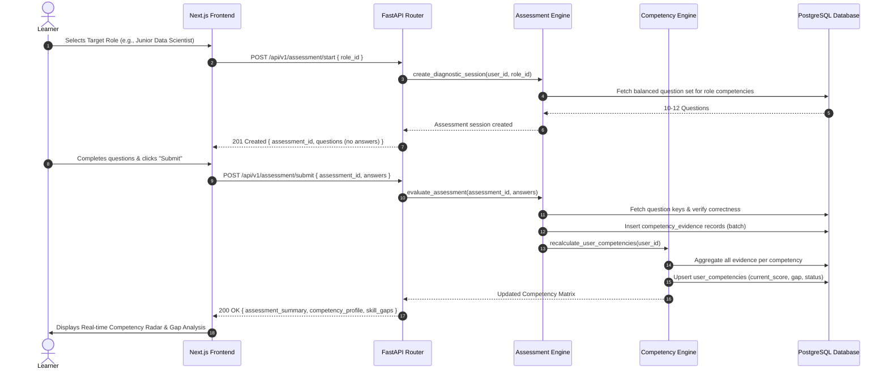
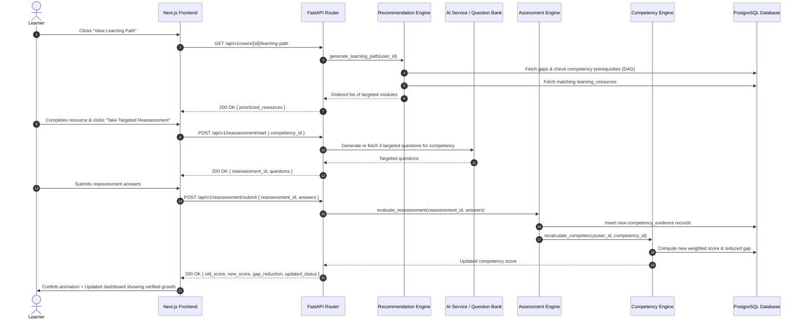

# SkillCompass — High-Level Architecture

## 1. System Overview & Architectural Topology

SkillCompass is architected as a modular, 5-tier web application designed to deliver rapid sub-second performance, strict domain separation, and deterministic competency tracking.

```
                 ┌──────────────────────────────────────┐
                 │              Next.js UI              │
                 │          React + TypeScript          │
                 │    (App Router, Dashboard, Forms)    │
                 └──────────────────┬───────────────────┘
                                    │
                                    │ HTTPS / REST (JSON)
                                    ▼
                 ┌──────────────────────────────────────┐
                 │             FastAPI API              │
                 │     (Routing, Pydantic, CORS)        │
                 └──────────────────┬───────────────────┘
                                    │
              ┌─────────────────────┼─────────────────────┐
              │                     │                     │
              ▼                     ▼                     ▼
      ┌───────────────┐     ┌───────────────┐     ┌───────────────┐
      │  Assessment   │     │  Competency   │     │Recommendation │
      │    Engine     │     │    Engine     │     │    Engine     │
      │ (Grading &    │     │ (Deterministic│     │ (DAG Sorting  │
      │  Evidence)    │     │  Math & Gaps) │     │  & Pathing)   │
      └───────┬───────┘     └───────┬───────┘     └───────┬───────┘
              │                     │                     │
              └─────────────────────┼─────────────────────┘
                                    │
                                    ▼
                 ┌──────────────────────────────────────┐
                 │        PostgreSQL / Supabase         │
                 │   (Relational Schema, Evidence Log)  │
                 └──────────────────┬───────────────────┘
                                    │
                                    ▼
                 ┌──────────────────────────────────────┐
                 │              LLM / AI                │
                 │    (Generation + Interpretation)     │
                 │       (OpenAI / Groq API)            │
                 └──────────────────────────────────────┘
```

---

## 2. Layer-by-Layer Architectural Breakdown

### 2.1 Presentation Layer (Frontend)
- **Technology:** Next.js 14 (App Router), React 18, TypeScript, Tailwind CSS, Lucide Icons, Recharts.
- **Responsibilities:**
  - Rendering interactive user interfaces across the complete competency lifecycle.
  - Presenting the **Diagnostic Assessment Wizard** with instant feedback and timed states.
  - Rendering the **Learner Competency Dashboard**, featuring interactive radar charts comparing `current_score` vs `required_score`.
  - Displaying the **Recommended Learning Path**, allowing users to launch learning resources and trigger targeted reassessments.
  - Maintaining client-side navigation and optimistic UI updates.
- **Key Boundary:** Contains zero scoring algorithms and zero database access. Communicates exclusively with the API Layer using typed HTTP requests.

### 2.2 API Layer (FastAPI)
- **Technology:** Python 3.11, FastAPI, Uvicorn, Pydantic v2.
- **Responsibilities:**
  - Exposing structured, validated RESTful endpoints (`/api/v1/...`).
  - Request payload validation, type enforcement, and serialization using Pydantic models.
  - Handling HTTP status codes, structured JSON error envelopes, and CORS headers.
  - Coordinating transactions by passing requests to appropriate domain business logic engines.
- **Key Boundary:** Acts strictly as an orchestrator. Contains no business calculations or direct SQL queries.

### 2.3 Business Logic Layer (Core Engines)
The core intelligence of SkillCompass is partitioned into three specialized, deterministic engines:

#### A. Assessment Engine
- Validates submitted answers against canonical answer keys.
- Computes item-level binary accuracy ($1$ or $0$) and response metadata.
- Maps question outcomes to associated competency IDs based on pre-calibrated weights.
- Generates structured, immutable **Competency Evidence Records**.

#### B. Competency Engine
- The mathematical core of SkillCompass.
- Ingests all historical and newly generated evidence for a learner.
- Applies the deterministic competency formula:
  $$\text{Current Score} = \frac{\sum (\text{Evidence Weight} \times \text{Result})}{\sum \text{Total Possible Weight}} \times 100$$
- Computes skill gap vectors against role benchmarks:
  $$\text{Skill Gap} = \max(0, \text{Required Score} - \text{Current Score})$$
- Determines qualitative proficiency tiers: `NOVICE` ($0-39$), `DEVELOPING` ($40-69$), `PROFICIENT` ($70-89$), `MASTER` ($90-100$).

#### C. Recommendation Engine
- Analyzes the computed skill gap vector.
- Traverses the competency dependency graph (DAG) to ensure prerequisites are satisfied before recommending advanced modules.
- Generates an ordered, actionable learning path composed of targeted micro-learning resources.

### 2.4 Data Layer (PostgreSQL / Supabase)
- **Technology:** PostgreSQL 15+ (hosted via Supabase or local PostgreSQL instance), SQLAlchemy 2.0.
- **Responsibilities:**
  - Enforcing referential integrity across relational tables (`users`, `roles`, `competencies`, `questions`, etc.).
  - Storing immutable audit logs of all assessment events and evidence entries (`competency_evidence`).
  - Maintaining ACID transactional guarantees during assessment completions and score updates.
- **Key Boundary:** Does not store arbitrary unvalidated JSON blobs for critical relations; relational schema guarantees query predictability.

### 2.5 AI Layer (External LLM)
- **Technology:** OpenAI API (`gpt-4o-mini` / `gpt-4o`) or Groq (`llama-3-70b-versatile`) with JSON Mode.
- **Responsibilities:**
  - **Question Generation:** On-demand generation of novel assessment questions for targeted reassessments matching specific competency taxonomies and difficulty levels.
  - **Contextual Feedback:** Generating personalized explanations for why a learner's selected answer was incorrect and providing concise conceptual clarity.
  - **Semantic Mapping:** Suggesting alignment between unstructured learning materials and standard competency nodes.
- **Strict Boundary:** **The AI Layer is never permitted to determine or adjust a learner's competency score.**

---

## 3. Detailed Request / Response Lifecycles

### 3.1 Diagnostic Assessment Flow



### 3.2 Adaptive Learning & Targeted Reassessment Flow



---

## 4. Key Architectural Guarantees

| Metric / Attribute | Architectural Guarantee | Mechanism |
| :--- | :--- | :--- |
| **Auditability** | Every score change is traceable to discrete evidence. | `competency_evidence` table stores raw question attempts, timestamps, and weights. |
| **Idempotency** | Re-submitting the same assessment does not double-count scores. | Unique constraint on `(assessment_id, question_id)` in `assessment_answers`. |
| **Explainability** | Learner can see exactly why their score is $X$. | Simple mathematical formula: $\frac{\text{Correct Weights}}{\text{Total Weights}}$. No AI black box. |
| **Sub-second Latency** | Dashboard and score calculations return in $< 250$ms. | Relational indexing on `user_id` and `competency_id` with synchronous in-memory scoring. |
| **AI Isolation** | AI service outages do not bring down core platform. | Pre-seeded fallback question catalog in `questions.json` handles assessments if LLM API is unavailable. |
