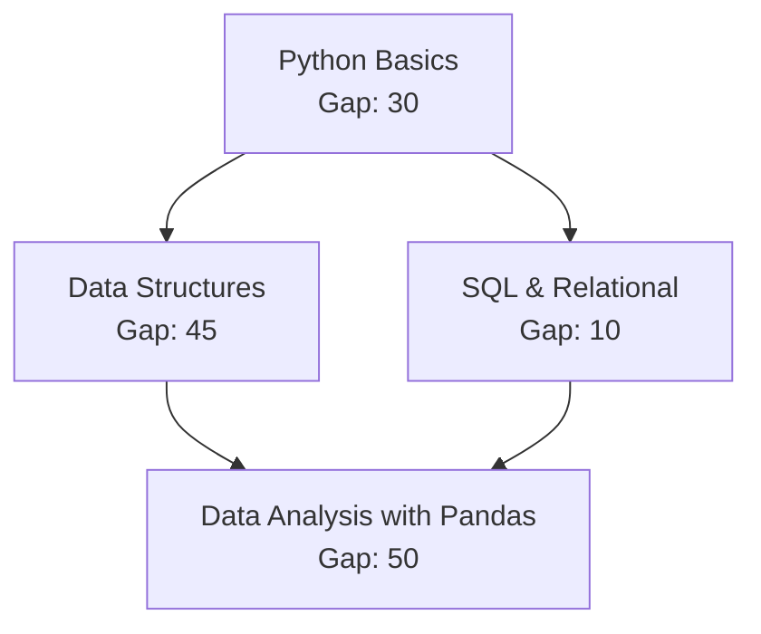

# SkillCompass — Low-Level Architecture

## 1. Introduction

This document details the internal design, class responsibilities, mathematical algorithms, and execution flows for all backend services in SkillCompass. It serves as an exact implementation specification for the engineering team.

---

## 2. Assessment Engine (`assessment_service.py`)

### 2.1 Overview & Responsibilities
The **Assessment Engine** orchestrates diagnostic and targeted assessment sessions. It is responsible for:
1. Fetching a balanced set of questions representing the target role's competencies.
2. Stripping correct answers from question payloads before delivering them to the frontend.
3. Ingesting learner submissions and evaluating correctness against canonical keys.
4. Calculating raw assessment scores (total correct vs. total questions).
5. Mapping questions to one or more competencies with calibrated weights.
6. Generating immutable `competency_evidence` entries in the database.

### 2.2 Class Design & Public Interface

```python
class AssessmentEngine:
    def __init__(self, db_session: AsyncSession, ai_service: Optional[AIService] = None):
        self.db = db_session
        self.ai = ai_service

    async def create_diagnostic_assessment(
        self, user_id: UUID, role_id: UUID
    ) -> AssessmentPublicSchema:
        """
        1. Queries role_competencies for all required competencies of the role.
        2. Selects 2-3 active questions per competency from the question bank.
        3. Creates an 'assessments' record with status='IN_PROGRESS'.
        4. Returns the session ID and sanitized questions (answers omitted).
        """
        ...

    async def submit_assessment(
        self, assessment_id: UUID, answers: List[AnswerSubmissionSchema]
    ) -> AssessmentResultSchema:
        """
        1. Validates that assessment is in 'IN_PROGRESS' status.
        2. Evaluates each submitted answer against question.correct_answer.
        3. Records individual rows in 'assessment_answers'.
        4. Calculates binary correctness (1 or 0) for each question.
        5. For each question, retrieves question_competencies weights.
        6. Inserts rows into 'competency_evidence'.
        7. Marks assessment status='COMPLETED' and sets completed_at timestamp.
        8. Invokes CompetencyEngine to trigger profile recalculation.
        9. Returns detailed submission results with AI explanations.
        """
        ...
```

### 2.3 Sanitization Rule
When questions are served to the client, the backend Pydantic model `QuestionPublicSchema` **must strictly omit**:
- `correct_answer`
- `explanation`
- Internal grading weights

Only `id`, `text`, `question_type`, `difficulty`, and `options` are transmitted to the presentation layer.

---

## 3. Competency Engine (`competency_service.py`)

### 3.1 Overview & Responsibilities
The **Competency Engine** is the deterministic scoring authority of SkillCompass. It contains zero stochastic or LLM components. It is responsible for:
1. Ingesting evidence records from the `competency_evidence` table.
2. Computing the deterministic competency score ($0-100$) per competency.
3. Comparing current scores against target role requirements to compute the skill gap.
4. Assigning categorical proficiency tiers (`NOVICE`, `DEVELOPING`, `PROFICIENT`, `MASTER`).
5. Incrementally recalibrating competency scores after targeted reassessments.

### 3.2 Transparent Mathematical Scoring Model

The engine operates on an evidence-based weighted scoring formula:

#### Current Score Formulation
For any given competency $c$ and user $u$:
$$\text{CurrentScore}(u, c) = \left( \frac{\sum_{i=1}^{N} (w_i \times r_i)}{\sum_{i=1}^{N} w_i} \right) \times 100$$

Where:
- $N$ = Total pieces of evidence recorded for competency $c$.
- $w_i$ = Importance weight of the evidence item (default question weight = $1.0$; high-difficulty question = $1.5$; reassessment = $1.2$).
- $r_i$ = Result of the item: $1.0$ for correct, $0.0$ for incorrect.

*Example:*  
A learner attempts 3 questions mapped to "Python Functions":
- Question 1 (Weight 1.0): Correct ($r_1 = 1.0$) $\rightarrow 1.0 \times 1.0 = 1.0$
- Question 2 (Weight 1.0): Incorrect ($r_2 = 0.0$) $\rightarrow 1.0 \times 0.0 = 0.0$
- Question 3 (Weight 1.5): Correct ($r_3 = 1.0$) $\rightarrow 1.5 \times 1.0 = 1.5$
- $\sum (w_i \times r_i) = 1.0 + 0.0 + 1.5 = 2.5$
- $\sum w_i = 1.0 + 1.0 + 1.5 = 3.5$
- $\text{CurrentScore} = \left(\frac{2.5}{3.5}\right) \times 100 = 71.43 \rightarrow 71$

#### Skill Gap Formulation
Given the role's required score threshold $R_c$:
$$\text{SkillGap}(u, c) = \max(0, R_c - \text{CurrentScore}(u, c))$$

- If Required = $75$ and Current = $71$, $\text{SkillGap} = 4$.
- If Required = $75$ and Current = $85$, $\text{SkillGap} = 0$ (Target met or exceeded).

#### Categorical Status Assignment
```python
def compute_proficiency_status(score: float) -> str:
    if score >= 90:
        return "MASTER"
    elif score >= 70:
        return "PROFICIENT"
    elif score >= 40:
        return "DEVELOPING"
    else:
        return "NOVICE"
```

### 3.3 Class Design & Public Interface

```python
class CompetencyEngine:
    def __init__(self, db_session: AsyncSession):
        self.db = db_session

    async def calculate_competency_score(
        self, user_id: UUID, competency_id: UUID
    ) -> float:
        """
        Aggregates all rows in competency_evidence for (user_id, competency_id).
        Computes weighted average. Returns value between 0.0 and 100.0.
        """
        ...

    async def recalibrate_user_profile(
        self, user_id: UUID, role_id: UUID
    ) -> List[UserCompetency]:
        """
        1. Iterates over all role_competencies for role_id.
        2. Calculates current_score from evidence for each competency.
        3. Computes skill_gap = max(0, required_score - current_score).
        4. Assigns status enum (NOVICE, DEVELOPING, PROFICIENT, MASTER).
        5. Upserts records into 'user_competencies'.
        6. Returns updated profile records.
        """
        ...
```

---

## 4. Recommendation Engine (`recommendation_service.py`)

### 4.1 Overview & Responsibilities
The **Recommendation Engine** transforms diagnostic skill gaps into an actionable, structured learning pathway. It is responsible for:
1. Filtering for competencies where $\text{SkillGap} > 0$.
2. Enforcing prerequisite dependency ordering using a Directed Acyclic Graph (DAG).
3. Associating curated `learning_resources` with identified deficit nodes.
4. Ordering the pathway to prioritize high-leverage foundational gaps before advanced topics.

### 4.2 Prerequisite Topological Ordering Algorithm

Competencies have a self-referential `prerequisite_id` relationship (or adjacency list). Recommending an advanced topic when its foundational prerequisite has a large skill gap leads to cognitive overload and failure.



#### Selection and Sorting Algorithm:
1. **Identify Gap Set:** Collect all competencies $C$ where $\text{SkillGap}(c) > 0$.
2. **Prerequisite Check:** For each competency $c \in C$, check if $c.\text{prerequisite\_id}$ is satisfied. A prerequisite is satisfied if:
   - It has no prerequisite (`prerequisite_id IS NULL`), OR
   - The user's `current_score` on the prerequisite meets or exceeds $70$ (`PROFICIENT`).
3. **Queue Prioritization:** Unlocked competencies are sorted by:
   - Primary: Prerequisites first (Topological Level)
   - Secondary: Gap magnitude descending ($\text{SkillGap} \downarrow$)
4. **Resource Mapping:** Join `competency_resources` to fetch curated tutorials, videos, or interactive docs.

---

## 5. AI Service (`ai_service.py`)

### 5.1 Overview & Responsibilities
The **AI Service** interfaces with external Large Language Models (OpenAI / Groq) via strict JSON schema prompting. It acts solely as an interpretative and generative accelerator:

| Capability | Allowed Actions | Strictly Prohibited Actions |
| :--- | :--- | :--- |
| **Question Generation** | Generate realistic scenario questions, distractors, and explanations for a given competency. | Deciding how much weight the question carries in scoring. |
| **Feedback Synthesis** | Explain why an answer choice was wrong and guide the learner toward core concepts. | Overriding the test result or awarding "bonus" points. |
| **Semantic Mapping** | Tag raw learning resources with relevant competency keywords. | Altering role requirements or prerequisite hierarchies. |

### 5.2 Strict Prompting Contract & Fallback Mechanism

Every prompt enforces JSON mode:

```python
class AIService:
    async def generate_explanation(
        self, question_text: str, selected_option: str, correct_option: str
    ) -> str:
        """
        Sends structured prompt to LLM:
        'Explain in 2 concise sentences why {selected_option} is incorrect and {correct_option} is correct for: {question_text}'
        Falls back to question.explanation if API call times out or fails.
        """
        ...

    async def generate_targeted_questions(
        self, competency_name: str, count: int = 3
    ) -> List[Dict[str, Any]]:
        """
        Generates 3 novel multiple-choice items adhering to the standard Question schema.
        Validates JSON schema before returning.
        Falls back to unattempted pre-seeded questions if LLM fails.
        """
        ...
```

---

## 6. End-to-End API Layer Processing Cycle

The typical request flow follows a strict 5-stage lifecycle:

```
[Client UI]
    │
    │ 1. HTTP Request (e.g. POST /api/v1/assessment/submit)
    ▼
[FastAPI Router]
    │ 2. Schema Validation (Pydantic enforces types & non-null fields)
    ▼
[Domain Service] (e.g., AssessmentEngine)
    │ 3. Deterministic Business Logic & Evidence Generation
    ├───► [Database] (Persist evidence & answers via SQLAlchemy)
    ├───► [AI Service] (Optional: Fetch real-time explanation)
    └───► [CompetencyEngine] (Recalculate mathematical scores & gaps)
    ▼
[FastAPI Router]
    │ 4. Response Serialization (Pydantic strips internal fields)
    ▼
[Client UI]
    5. UI receives typed JSON payload and updates state
```

This guarantees complete isolation between client-facing interfaces, database models, and external AI dependencies.
