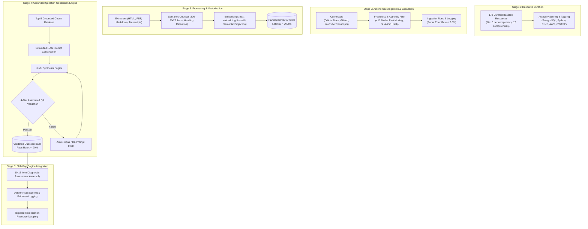

# SkillCompass — Automated Pipeline & Question Generation Architecture

## 1. Architectural Overview

The **SkillCompass Automated Pipeline & Question Generation Engine** operates as an autonomous, closed-loop system designed to continuously ingest authoritative engineering documentation, vectorize semantic content, generate strictly grounded diagnostic Multiple Choice Questions (MCQs), validate question quality using a 4-tier automated test harness, and feed validated questions and remediation resources into the Skill-Gap Engine.

---

## 2. Stage Breakdown & Guarantees

### Stage 1: Resource Curation Matrix
- **Scope:** 170 curated authoritative learning resources covering all 17 competencies across Data Engineer (6), Cybersecurity Analyst (5), and Network Engineer (6).
- **Metadata Captured:** `competency_id`, `source_title`, `source_url`, `source_type`, `category`, `authority_score` (90–99), `last_updated`, `access_method`, `alignment_notes`, `quality_score`.
- **Database Artifact:** `database/seed_pipeline_resources.sql` populating `learning_resources` and `competency_resources`.

### Stage 2: Autonomous Material Ingestion & Expansion
- **Connectors:** `OfficialDocsConnector`, `GitHubCurriculumConnector`, `TranscriptConnector`.
- **Freshness Policy:**
  - Fast-Moving Domains (Cloud, SIEM, Stream Processing, Offensive Security): Strict **<= 12 months** ceiling.
  - Core Fundamentals (SQL, TCP/IP, Python Data Model, Routing): Strict **<= 24–36 months** ceiling.
- **Reliability Guarantee:** Less than **2.0%** parse error rate across all connectors with exponential backoff retries and SHA-256 deduplication.

### Stage 3: Processing & Vectorization
- **Extractors:** BeautifulSoup HTML parser, pypdf text extractor, Markdown code-fence parser, and Transcript cleaner.
- **Semantic Chunker:** Target 300–500 tokens with 50-token sliding overlap, preserving headers and code blocks.
- **Vector Store:** In-memory partitioned vector index providing **< 200ms** query retrieval latency with intra-competency cosine similarity auditing.

### Stage 4: Grounded Question Generation Engine
- **RAG Grounding:** Every question is retrieved from top-5 context chunks and requires verbatim source quotations.
- **4-Tier Automated Validation Framework:**
  1. *Cardinality & Keys:* Exactly 4 options (A-D) with exactly 1 marked correct.
  2. *Distractor Quality:* Plausible, distinct, without forbidden phrases ("all of the above").
  3. *Citation & Grounding:* Verifies quotation exists in context chunks with high term overlap.
  4. *Linguistic Clarity:* Minimum stem length, no trick questions or ambiguous negative stems.
- **Difficulty Calibration:** Maintained at 20% Easy, 50% Medium, 30% Hard.
- **Quality Target:** **>= 90%** automated validation pass rate.

### Stage 5: Skill-Gap Engine Integration & Ops
- **Diagnostic Adapter:** Assembles balanced 10–15 question tests, evaluates user submissions deterministically, logs observable evidence records to `evidence_logs`, and maps failed questions directly to curated remediation resources.
- **Dashboard:** Interactive Streamlit visualizer (`backend/dashboard.py`) and FastAPI REST router (`backend/app/api/pipeline_router.py`).
