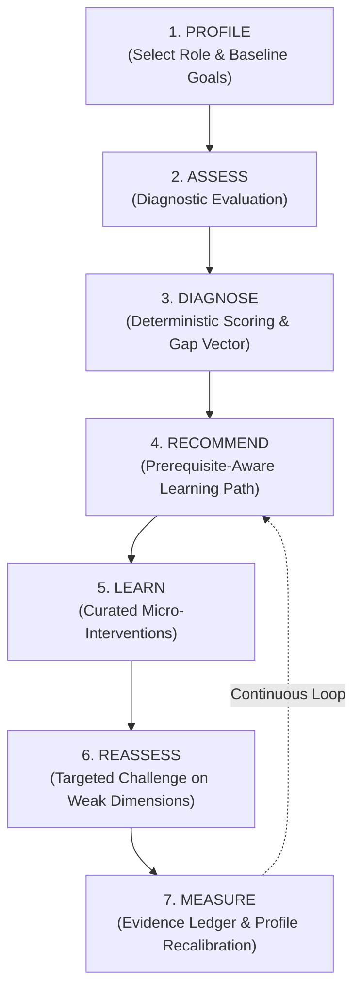
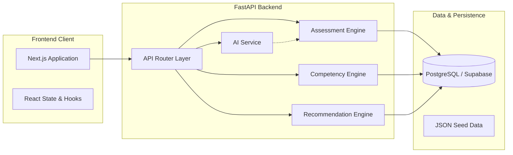

# SkillCompass — Project Architecture

## 1. Executive Summary & Core Positioning

**SkillCompass** is an AI-powered Competency Intelligence & Adaptive Learning Platform designed to close the disconnect between traditional learning credentials and verifiable skill capability.

### The Core Problem
In traditional corporate and academic learning systems:
- Learners complete courses, watch videos, and earn completion certificates.
- Organizations equate "course completion" with "readiness."
- Yet, day-one on the job reveals critical skill deficits. 

> **Foundational Axiom:**  
> **"COURSE COMPLETION ≠ COMPETENCY"**

SkillCompass replaces passive check-the-box course completion with an active, closed-loop competency intelligence engine. It continuously diagnoses actual ability, maps deficits against explicit industry role standards, prescribes targeted micro-learning interventions, validates improvement through evidence-based reassessment, and dynamically recalibrates learner competency profiles.

---

## 2. Core Product Philosophy & Technical Principle

Traditional "AI learning tools" often suffer from two extremes:
1. **Dumb rule engines:** Inflexible multiple-choice quizzes with static recommendations.
2. **Hallucinatory black-box LLMs:** Prompting an LLM to evaluate a learner and return an arbitrary score (e.g., *"You are 82% proficient in Python"*), which lacks explainability, repeatability, auditability, and rigor.

SkillCompass enforces a strict architectural boundary:

```
┌────────────────────────────────────────────────────────┐
│                   TECHNICAL PRINCIPLE                  │
│                                                        │
│  "AI interprets and generates.                         │
│   Structured logic calculates and tracks competency."  │
└────────────────────────────────────────────────────────┘
```

- **What AI Does:** Generates contextualized questions, formulates natural-language explanations, extracts semantic concepts, and generates constructive feedback.
- **What AI Never Does:** Directly assign or alter mathematical competency scores, bypass dependency graphs, or fabricate proficiency states.
- **What Structured Logic Does:** Calculates weighted mastery formulas, computes competency gap vectors, validates prerequisite topological orders, updates evidence tables, and enforces data integrity.

---

## 3. The Core Competency Loop

SkillCompass executes a continuous 7-stage competency loop:



1. **PROFILE:** Learner selects or is assigned a target professional role (e.g., *Junior Data Scientist*). System retrieves the competency benchmark matrix for that role.
2. **ASSESS:** System administers a balanced, multi-competency baseline diagnostic assessment.
3. **DIAGNOSE:** Deterministic scoring engine processes raw answers, updates competency evidence, and computes precise skill gaps against required role thresholds.
4. **RECOMMEND:** Recommendation engine evaluates gaps and dependency constraints (prerequisites) to generate a prioritized, phased learning path.
5. **LEARN:** Learner engages with curated, byte-sized learning resources targeted specifically to their deficit areas.
6. **REASSESS:** Upon resource completion, system serves a targeted reassessment covering only the unmastered competency nodes.
7. **MEASURE:** New performance evidence updates the user's competency ledger, shrinks the gap vector, and updates the live competency graph on the learner dashboard.

---

## 4. Main Users & Stakeholder Personas

| Persona | Motivation | Platform Interaction |
| :--- | :--- | :--- |
| **Learner / Job Seeker** | Needs to know *exact* readiness for target roles and avoid wasting hours re-learning concepts they already know. | Role selection, diagnostic testing, dashboard visualizer, targeted learning modules, reassessments. |
| **Hiring Team / Engineering Lead (Future)** | Needs evidence-backed validation of candidate capabilities rather than superficial resume claims. | Competency matrix viewer, verified skill transcripts, rubric benchmarks. |
| **Platform Administrator / Curriculum Designer** | Authors role competency models, defines prerequisites, associates curated resources. | Role mapping, question catalog maintenance, competency taxonomy management. |

---

## 5. Technology Stack & Decision Rationale

To deliver a battle-tested, high-performance system within a **24-hour hackathon** while avoiding overengineering, the platform utilizes a tightly coupled, lightweight monolithic architecture:

| Tier | Technology | Rationale for Selection |
| :--- | :--- | :--- |
| **Frontend** | **Next.js 14 (App Router) + React + TypeScript** | Server-side rendering, fast developer iteration, typed component contracts, native routing, rich dashboard ecosystem (Lucide, Tailwind/Vanilla CSS). |
| **Styling** | **Tailwind CSS + Vanilla CSS Modules** | Rapid, design-token-driven responsive UI styling without bloated CSS frameworks or manual CSS selector sprawl. |
| **Backend** | **Python 3.11 + FastAPI** | Native async IO, automatic OpenAPI/Swagger documentation, fast execution, seamless integration with AI libraries (LangChain/OpenAI/Anthropic SDKs). |
| **ORM / Data Access**| **SQLAlchemy 2.0 (Async) + Pydantic v2** | Strong typing from database layer through API schemas, preventing payload inconsistencies and type drift. |
| **Database** | **PostgreSQL (Supabase Hosted or Direct)** | Rock-solid relational integrity, JSONB support for flexible metadata/options, robust constraint checking, zero-friction managed connection. |
| **AI / LLM** | **OpenAI API / Groq API (JSON Mode)** | Strict structured JSON schema extraction for dynamic question authoring and feedback synthesis. |

### Strict Constraints Observed
- ❌ **No Docker:** No container build overhead, volume mounting issues, or slow startup during live demos.
- ❌ **No Microservices:** Eliminates distributed tracing, network latency, cross-service auth, and orchestration complexity.
- ❌ **No Message Brokers (Kafka/RabbitMQ):** Synchronous HTTP/REST flows are clean, fast, and sufficient for the MVP scale.

---

## 6. Core System Modules



1. **API Router Layer (`backend/app/api`):** Exposes clean REST endpoints for auth, assessment orchestration, dashboard analytics, and learning updates.
2. **Assessment Engine (`backend/app/services/assessment_service.py`):** Selects calibrated questions, validates submissions, computes item-level accuracy, and records raw response telemetry.
3. **Competency Engine (`backend/app/services/competency_service.py`):** Runs the deterministic mathematical formulation: compiles weighted evidence, checks confidence thresholds, computes current vs. required delta, and manages status transitions (*Novice*, *Developing*, *Proficient*, *Master*).
4. **Recommendation Engine (`backend/app/services/recommendation_service.py`):** Applies topological sorting across competency DAGs (Directed Acyclic Graphs), filters out satisfied competencies, and orders learning tasks by dependency and gap severity.
5. **AI Service (`backend/app/services/ai_service.py`):** Calls LLMs with few-shot system prompts to generate novel diagnostic items, detailed step-by-step diagnostic feedback, and concept hints.
6. **Data Access Layer (`backend/app/models`):** Relational tables ensuring referential integrity across users, roles, competencies, questions, and evidence logs.

---

## 7. MVP Scope vs. Out-of-Scope (24-Hour Hackathon Boundaries)

To ensure delivery of a fully functioning, beautiful, end-to-end user experience, scope boundaries are strictly demarcated:

### IN-SCOPE for MVP
- **Pre-seeded Domain:** 1 High-Demand Benchmark Role (*Junior Data Scientist* / *Backend Python Engineer*) with a complete graph of 6–8 distinct competencies (e.g., Python Basics, Data Structures, SQL & Relational Models, Data Analysis with Pandas, Statistical Inference).
- **Target Profile Selection:** Learner sets up profile and selects the benchmark role.
- **Full Diagnostic Assessment:** 10–12 question diagnostic exam covering the entire role competency tree.
- **Deterministic Gap Analysis:** Real-time computation of raw score, weighted competency scores (0–100), required thresholds, and gap vector.
- **Visual Competency Radar / Graph:** Live interactive visual radar/bar charts showing current vs. target capability.
- **Personalized Recommended Learning Path:** Dynamic queue of micro-learning resources prioritized by prerequisite hierarchy and gap size.
- **Targeted Reassessment Flow:** Interactive 3–5 question focused quiz on the learner's weakest competency after marking a resource complete.
- **Profile Recalibration:** Demonstrable score increase, gap reduction, and updated status on the live dashboard.
- **AI-Powered Contextual Explanations:** Real-time explanation for incorrect diagnostic answers generated via LLM.

### EXPLICITLY OUT-OF-SCOPE (Post-Hackathon)
- Multi-tenant enterprise RBAC and team analytics dashboards.
- Arbitrary role resume parser or raw job description scrapers.
- Real-time video/audio proctoring during assessments.
- Production payment gateways, subscriptions, or Stripe billing.
- Third-party LMS LTI integrations (Canvas, Blackboard, Moodle).
- Social leaderboards, multi-player quizzes, or public forums.
- Complex microservice orchestration or background distributed celery workers.

---

## 8. Scalability & Future Evolution

While engineered as a modular monolith for maximum hackathon velocity, the domain boundary design enables clean forward evolution:
1. **Async Worker Integration:** When question generation or semantic analysis requires high concurrency, background tasks can transition seamlessly to Redis + Celery or AWS SQS without rewriting business logic.
2. **Graph Database Migration:** The relational `prerequisite_id` adjacency schema can be augmented or migrated to Neo4j for massive multi-tier skill ontologies with millions of nodes.
3. **Pluggable Question Providers:** The Assessment Engine can ingest questions from external repositories, Git repositories (evaluating code via AST), or third-party assessment APIs.
