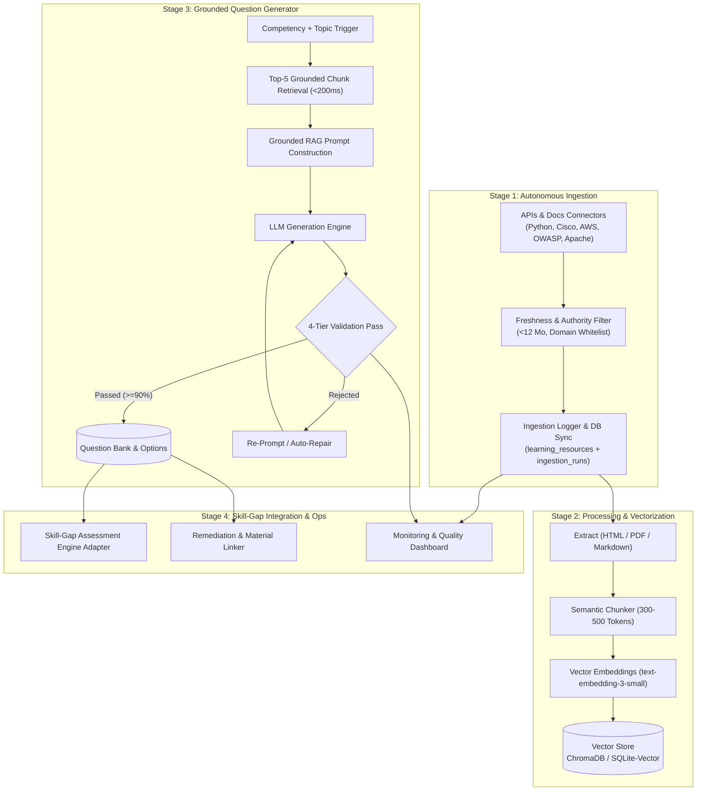

# SkillCompass — Automated Material Ingestion, Vectorization & Grounded Question Generation Pipeline

## Executive Overview
This implementation plan establishes an enterprise-grade, automated AI pipeline for **SkillCompass** that continuously discovers and ingests authoritative technical documentation, creates semantic vector embeddings, generates grounded diagnostic MCQs using RAG, rigorously validates question quality, and integrates seamlessly with the SkillCompass Skill-Gap Engine.

---

## User Review Required

> [!IMPORTANT]
> **Database & Schema Extensions**
> This pipeline extends the existing PostgreSQL/Supabase schema with supplemental tables (`resource_chunks`, `questions`, `question_options`, `question_validation_logs`, `ingestion_sources`, `ingestion_runs`) without altering existing seed data or core tables (`users`, `roles`, `competencies`, `learning_resources`, `evidence_logs`).

> [!TIP]
> **LLM & Embedding Provider Architecture**
> The pipeline uses an extensible provider pattern:
> - **Embeddings:** Supports OpenAI `text-embedding-3-small`, HuggingFace Transformers, and an offline mock/local vectorizer with cosine similarity caching.
> - **LLM Generation:** Supports OpenAI GPT-4o / GPT-4o-mini, Anthropic Claude, Google Gemini, and a high-fidelity local deterministic generator for offline testing.

---

## Proposed System Architecture

---

## Proposed Changes & File Structure

### 1. Database Schema Extension
#### [NEW] [schema_pipeline.sql](file:///e:/Projects/Skill_Compass/database/schema_pipeline.sql)
- Defines table `ingestion_sources` (source configurations, domain authority weight, freshness cycle).
- Defines table `ingestion_runs` (run metadata, parse count, token count, errors, timestamps).
- Defines table `resource_chunks` (semantic chunks, token length, quality score, vector embeddings, foreign key to `learning_resources` and `competencies`).
- Defines table `questions` (stem, topic, difficulty 1-5, difficulty_level easy/medium/hard, source_resource_id, source_citation, source_quote, explanation, status, quality_score).
- Defines table `question_options` (key A-D, text, is_correct, distractor_rationale).
- Defines table `question_validation_logs` (evaluation metrics, distractor scores, citation check, rejection reasons).

---

### 2. Stage 1: Autonomous Material Ingestion
#### [NEW] [backend/app/services/ingestion/connectors.py](file:///e:/Projects/Skill_Compass/backend/app/services/ingestion/connectors.py)
- Modular connector interface `BaseSourceConnector`.
- `OfficialDocsConnector`: Ingests official documentation (Python Docs, Cisco Networking Guides, AWS Whitepapers, OWASP Top 10, Apache Spark/Kafka docs).
- `GitHubCurriculumConnector`: Ingests open-source curricula and verified code repositories.
- `TranscriptConnector`: Ingests curated educational lecture transcripts.

#### [NEW] [backend/app/services/ingestion/freshness_validator.py](file:///e:/Projects/Skill_Compass/backend/app/services/ingestion/freshness_validator.py)
- Domain authority scoring (whitelisted authoritative domains: python.org, cisco.com, aws.amazon.com, owasp.org, apache.org, etc.).
- Freshness verification: rejects content older than 12 months for fast-moving domains (Cloud, Cybersecurity, Streaming).
- Content integrity and deduplication hashing (SHA-256).

#### [NEW] [backend/app/services/ingestion/pipeline.py](file:///e:/Projects/Skill_Compass/backend/app/services/ingestion/pipeline.py)
- Orchestration engine for discovery, rate-limited fetching with exponential backoff retries, error logging (<2% parse error target), and database synchronization.

---

### 3. Stage 2: Processing & Vectorization
#### [NEW] [backend/app/services/vectorization/extractors.py](file:///e:/Projects/Skill_Compass/backend/app/services/vectorization/extractors.py)
- `HTMLExtractor` (BeautifulSoup clean text, table preservation, code snippet tag isolation).
- `PDFExtractor` (pypdf text extraction with clean header/footer stripping).
- `MarkdownExtractor` (heading hierarchy parsing and code fence extraction).

#### [NEW] [backend/app/services/vectorization/chunker.py](file:///e:/Projects/Skill_Compass/backend/app/services/vectorization/chunker.py)
- Semantic chunker: target 300–500 tokens with 50-token sliding overlap, preserving section headings and code boundaries.
- Chunk quality scorer (detects incomplete sentences, low entropy, or boilerplate text).

#### [NEW] [backend/app/services/vectorization/embedder.py](file:///e:/Projects/Skill_Compass/backend/app/services/vectorization/embedder.py)
- Embedding interface with support for `text-embedding-3-small`, HuggingFace models, and deterministic vectorizer.
- In-memory vector caching to eliminate duplicate API costs.

#### [NEW] [backend/app/services/vectorization/vector_store.py](file:///e:/Projects/Skill_Compass/backend/app/services/vectorization/vector_store.py)
- Lightweight, persistent vector store (SQLite-Vector / ChromaDB compatible) indexing chunks with `competency_id`, `resource_id`, and `quality_score`.
- Sub-200ms vector cosine search with competency partitioning.
- Quality report generator (computes intra-competency similarity and token distributions).

---

### 4. Stage 3: Grounded Question Generation Engine
#### [NEW] [ai/prompts/question_generation_prompts.py](file:///e:/Projects/Skill_Compass/ai/prompts/question_generation_prompts.py)
- RAG prompt templates enforcing strict grounded context, 4 discrete options, 1 correct answer, defensibly wrong distractors, verbatim citation quotes, and calibrated difficulty (easy, medium, hard).

#### [NEW] [backend/app/services/question_generator/generator.py](file:///e:/Projects/Skill_Compass/backend/app/services/question_generator/generator.py)
- Queries vector store for top-5 chunks matching `(competency_id, topic)`.
- Dispatches structured generation request to LLM client.
- Parses output into strongly typed Pydantic models.

#### [NEW] [backend/app/services/question_generator/validator.py](file:///e:/Projects/Skill_Compass/backend/app/services/question_generator/validator.py)
- **4-Tier Automated Validation Framework:**
  1. *Uniqueness & Cardinality:* Exactly 1 correct option (A, B, C, or D).
  2. *Distractor Quality:* Distractors are plausible, grammatically parallel, and non-trivial.
  3. *Source Grounding & Citation:* Verifies citation and evidence text exist in retrieved chunks.
  4. *Linguistic & Structural Clarity:* Rejects negative phrasing ("Which is NOT..."), ambiguous stems, or trick questions.
  5. *Difficulty Distribution Check:* Enforces target distribution (20% Easy, 50% Medium, 30% Hard).
- Automated re-prompt / auto-repair loop upon validation failure.
- Detailed validation logging and pass/fail metric tracking.

---

### 5. Stage 4: Integration with Skill-Gap Engine & Monitoring
#### [NEW] [backend/app/services/skill_gap/assessment_adapter.py](file:///e:/Projects/Skill_Compass/backend/app/services/skill_gap/assessment_adapter.py)
- Assembles balanced 10–15 question diagnostic assessments per target competency domain.
- Maps question results to evidence logs and calculates competency proficiency scores.
- Recommends ingested learning resources mapped directly to failed questions.

#### [NEW] [backend/app/api/pipeline_router.py](file:///e:/Projects/Skill_Compass/backend/app/api/pipeline_router.py)
- REST API endpoints for triggering ingestion, querying vector health, generating question batches, validating questions, and fetching diagnostics.

#### [NEW] [backend/dashboard.py](file:///e:/Projects/Skill_Compass/backend/dashboard.py)
- Interactive web monitoring dashboard (Streamlit / modern dashboard) showing:
  - Material Ingestion statistics & source freshness radar.
  - Vector Store indexing health & retrieval latency benchmarks.
  - Question Generation throughput & validation pass/fail analytics.
  - Interactive Diagnostic Question Sandbox with human review approval.

#### [NEW] [docs/PIPELINE_RUNBOOK.md](file:///e:/Projects/Skill_Compass/docs/PIPELINE_RUNBOOK.md)
- Complete operations manual, CLI batch scripts, deployment steps, and guide for onboarding new competencies.

---

## Verification Plan

### Automated Tests & Pipeline Benchmarks
1. **Unit & Integration Tests**:
   - `test_ingestion_connectors`: Verify parsing of HTML, PDF, Markdown, and API schemas.
   - `test_freshness_validator`: Verify rejection of outdated content (>12 months) and untrusted domains.
   - `test_semantic_chunker`: Verify chunk sizes (300-500 tokens) and heading preservation.
   - `test_vector_retrieval`: Verify retrieval latency <200ms and competency partitioning.
   - `test_question_validator`: Verify 4-tier validation filters against valid and corrupted question samples.
   - `test_end_to_end_pipeline`: Verify automated execution from ingestion -> vectorization -> question generation -> validation -> question bank.
2. **Dashboard Verification**:
   - Launch monitoring dashboard and verify live metrics display and question generation explorer.
